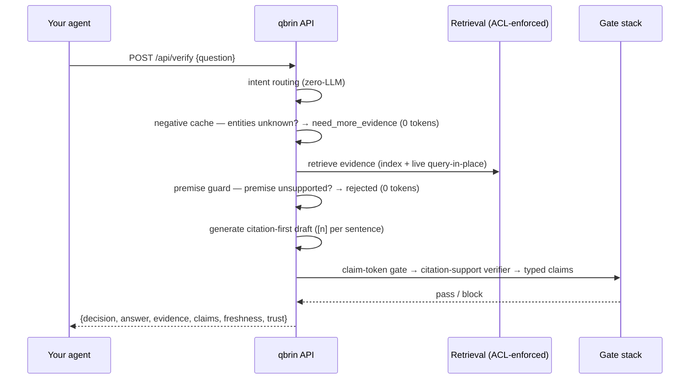

# qbrin — Building the Universal Trust Layer

**Retrieval tells the AI what it found. Qbrin decides whether it is safe enough to use.**

<p align="center">
  
</p>


Your agent is about to act. Is the thing it believes actually true in *your* systems?

qbrin sits between AI agents and an organisation's own sources (Postgres, Slack, Gmail, Drive, GitHub, uploads) and answers one question extremely well: **is this claim supported by the connected sources — yes, no, or not enough evidence?** Every verified answer carries a citation behind every sentence. When the evidence isn't there, qbrin says so instead of guessing.

```
npm install github:qbrin-stack/qbrin-js   # npm release coming soon
npx qbrin login                            # sign in with Google — no token to copy
```

`qbrin login` opens your browser, authenticates with Google, and writes a scoped token to `~/.qbrin/credentials`. After that, `new Qbrin()` just works — no key in code. *(A one-line `npm install qbrin` lands with the first npm release.)*

```js
import { Qbrin } from "qbrin";

const qb = new Qbrin(); // uses `qbrin login`; or new Qbrin({ apiKey: "qbrin_..." })

const v = await qb.verify("Can I refund $500 for order ORD-200?");

v.decision     // "verified" | "rejected" | "need_more_evidence"
v.answer       // "[1] The refund limit for Support Managers is $300. ..."
v.explanation  // why qbrin decided this
v.evidence     // the cited source excerpts, with document ids and scores
v.claims       // per-claim verdicts from the verifier (verified answers only)
v.freshness    // evidence vintage + whether live query-in-place rows were used
v.trust        // the full trust certificate (gates run, axes, hashes)
```

Zero dependencies. Node ≥ 18 (built-in `fetch`). TypeScript types included. MIT.

## The decision contract

| Decision | Meaning | What your agent should do |
|---|---|---|
| `verified` | The answer shipped and **every claim passed the citation-support gate** against the cited sources. | Act on `answer`; log `evidence`. |
| `rejected` | The sources contain evidence **against** the premise (false-premise guard or typed-claim contradiction). | Don't act; surface `explanation`. |
| `need_more_evidence` | The sources can't confirm it — entities unknown, or no gate-passing answer exists. | Ask for more context, connect a source, or escalate to a human. |

The failure mode this kills: an agent confidently acting on something that was never true in your systems. On a 1,000-question benchmark against naive RAG, qbrin took hallucinations on nonexistent entities from **56% to 0%**, with **zero false accepts** on out-of-domain traps across every run to date.

## How a verification runs



**Live query-in-place**: at question time qbrin can probe your own Postgres read-only for rows matching the question's entities (order ids, emails, names) and fold them into the audited evidence — so verification reflects the state of your systems *right now*, not the last index. Probes are deterministic (no LLM ever writes SQL; tables and columns come from an admin allowlist; question values are bind parameters) and run in a forced read-only transaction. Proven end-to-end in production.

## Errors

```js
import { AuthenticationError, RateLimitError, FeatureDisabledError } from "qbrin";

try {
  const v = await qb.verify("...");
} catch (e) {
  if (e instanceof RateLimitError) await sleep((e.retryAfter ?? 5) * 1000);
  if (e instanceof FeatureDisabledError) {
    // the server hasn't enabled the verification endpoint (VERIFY_API=1)
  }
}
```

The client retries 429/502/503/504 automatically (respecting `Retry-After`) and refuses non-HTTPS base URLs except localhost.

## Also in the box

```js
const a = await qb.ask("What is our refund policy?"); // grounded answer + citations
const hits = await qb.search("refund policy", { limit: 10 }); // universal search, no LLM
```

## Connecting your data

Your data reaches a verification two ways — indexed sources connected in the Console, or **live query-in-place** against your own systems at answer time. Six live connectors ship today — **Postgres, MySQL, Salesforce, any REST/JSON API, Slack, GitHub** — each deterministic (no LLM writes a query; tables/objects/fields come from an admin allowlist; question values are bind parameters or URL-encoded params) and read-only. Live sources verify against *current* state and only ever read the exact records a question is about. Setup and the security model are in **[CONNECTING.md](CONNECTING.md)**.

## Status & roadmap

The `verify` endpoint is in **beta** (flag-gated server-side). Roadmap: confidence bands, per-identity ACL for live sources, streaming.

Looking for Python? → the [qbrin Python SDK](https://github.com/qbrin-stack/qbrin-python).

---

Made by [qbrin](https://qbrin.com) — Building the Universal Trust Layer. Questions → katesaikishore@qbrin.com
